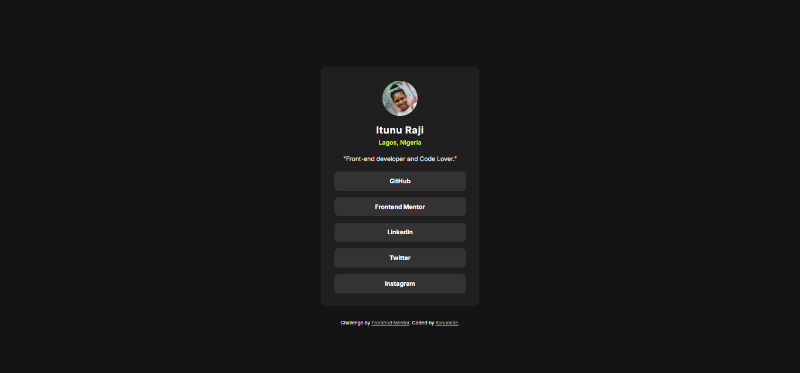

# Frontend Mentor - Social links profile solution

This is a solution to the [Social links profile challenge on Frontend Mentor](https://www.frontendmentor.io/challenges/social-links-profile-UG32l9m6dQ). Frontend Mentor challenges help you improve your coding skills by building realistic projects.

## Table of contents

- [Overview](#overview)
  - [The challenge](#the-challenge)
  - [Screenshot](#screenshot)
  - [Links](#links)
- [My process](#my-process)
  - [Built with](#built-with)
  - [What I learned](#what-i-learned)
  - [Continued development](#continued-development)
  - [Useful resources](#useful-resources)
- [Author](#author)
- [Acknowledgments](#acknowledgments)

## Overview

### The challenge

The challenge was to create a social profile page that includes:

- A visually appealing design with responsive layout.
- Profile details, including a picture, name, location, and bio.
- Clickable links to various social media platforms styled with hover effects.
- Clean and semantic HTML5 structure with accessible features.
### Screenshot

### Links

- Solution URL: 
- Live Site URL: 

## My process

### Built with

- Semantic HTML5
- Modern CSS
- Google Fonts ("Inter" font family)

### What I learned

- Using Flexbox for layout and alignment:
  Centering the main content with justify-content and align-items.
  Creating flexible vertical alignment for the profile and links.
- Hover Effects:
  Improved user experience by styling hover states for interactive buttons.
- Semantic HTML:
  Used <main>, <section>, <footer>, and <h3> for better accessibility and structure.

### Continued development

- Implement responsive design with media queries for mobile and larger screen sizes.
- Explore CSS variables for easier theme customization.

### Useful resources

- Google Fonts - Used for integrating the "Inter" font family.
- Frontend Mentor - Provided the challenge inspiration.

## Author

- Website - [Add your name here](https://itunu-i-raji.vercel.app/)
- Frontend Mentor - [@yourusername](https://www.frontendmentor.io/profile/itunumide)
- Twitter - [@yourusername](https://x.com/ITUNUMIDE3)

## Acknowledgments

- Thanks to Frontend Mentor for providing a structured challenge.
- Shoutout to online resources like MDN and CSS Tricks for guidance on best practices.
